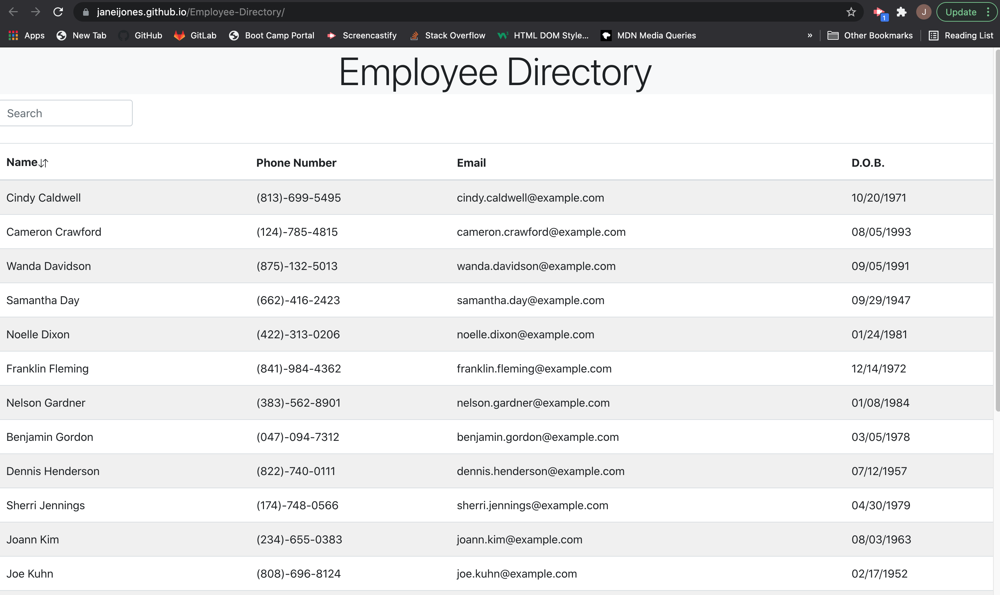

# Employee Directory 

## Description
An application that displays employees' non-sensitive information. The employees can be sorted by last name and searched by their full name.

## Deployed Site
https://janeijones.github.io/Employee-Directory

## Table of Contents
- [Installation](#installation)
- [Usage](#usage)
- [License](#license)
- [Questions](#questions)

Example picture:

## Installation

<ol> 
<li>run npm i </li>
<li>run npm start </li> </ol>

## Usage

This app pulls 25 random created users from the [Random User API](https://randomuser.me/) and places their non-sensitive information in a table. Users can sort each column by ascending or descending, or use the search bar to narrow down results.

<a href = "https://janeijones.github.io/Employee-Directory/"> Deployed Employee Directory Site </a>

## License 
<h3> MIT: </h3>
<ul> <li> <a href = "https://opensource.org/licenses/MIT"> MIT License </a></li> <li> This project is licensed under MIT</li> </ul>

## Questions
<ul> <li><a href = "https://github.com/janeijones">GitHub Profile </li>
<li> <a href = "https://janeijones.github.io/Employee-Directory/"> Visit Deployed Site </a></li>